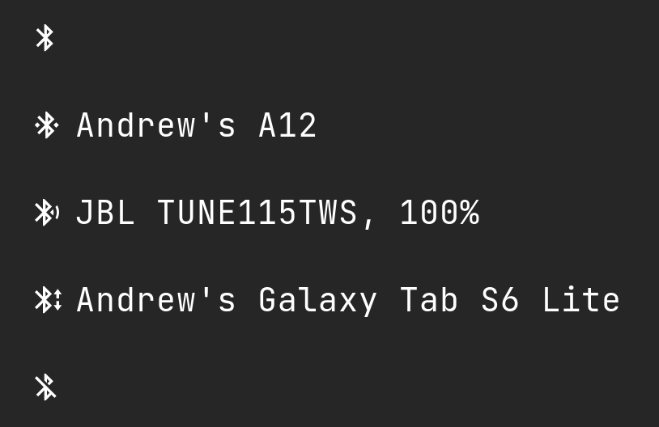

# Script: system-bluetooth-bluetoothctl

A shell script which displays information about the current bluetooth connection.

Use the toggle option to power on the controller and try to connect to all paired devices or to disconnect all connections and turn off the controller.

If there are several connections, then one is selected in the following order:
1) sending file, newest obexftp process
2) audio headset
3) device, first in the list




## Dependencies

* `bluetoothctl`
* `bluez-deprecated, obexftp (optional)`


## Configuration

Use the `set-alias` feature of `bluetoothctl` to customize your device names.

Bluez config example /etc/bluetooth/main.conf:
```
[General]

# Default adapter name
# Defaults to 'BlueZ X.YZ'
Name = <your-pc-name>

# How long to stay in discoverable mode before going back to non-discoverable
# The value is in seconds. Default is 180, i.e. 3 minutes.
# 0 = disable timer, i.e. stay discoverable forever
DiscoverableTimeout = 0

# Enables D-Bus experimental interfaces
# Possible values: true or false
Experimental = true

[Policy]

# AutoEnable defines option to enable all controllers when they are found.
# This includes adapters present on start as well as adapters that are plugged
# in later on. Defaults to 'true'.
AutoEnable=false
```

Enabling Experimental adds a battery level to your audio headset

To send file with obexftp use:
```Shell
# check with bluetoothctl devices Connected
MAC_ADDR=<your device mac address>
CHANNEL=$(sdptool search --bdaddr $MAC_ADDR OPUSH | awk '/Channel/ {printf $2}')
obexftp -S -H -U none -b $MAC_ADDR -B $CHANNEL -p /path/to/send
```


## Module

```ini
[module/bluetooth]
type = custom/script
exec = ~/polybar-scripts/system-bluetooth-bluetoothctl.sh
tail = true
interval = 2
click-left = ~/polybar-scripts/system-bluetooth-bluetoothctl.sh --toggle &
click-right = blueman-manager &
...
```

You can also change the icon font with --format by specifying your font number.
For example, to use font-1:
```ini
exec = ~/polybar-scripts/system-bluetooth-bluetoothctl.sh --format 2
```
