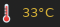

# Script: system-cpu-avgcoretemp

This script displays the average temperature across all cores of the CPU in your system.





## Dependencies

- lm_sensors (to detect CPU core temps)
- core utils (sed, awk, cut)


## Configuration

In the script the user must change the values of the two variableiables $START and $CORES. 

- $START should have the value of where the first core is represented when the user runs the "sensors" command. Example:
```
            1	acpitz-acpi-0
            2	Adapter: ACPI interface
            3	temp1:        +27.8°C  (crit = +105.0°C)
            4
            5	coretemp-isa-0000
            6	Adapter: ISA adapter
            7	Package id 0:  +34.0°C  (high = +100.0°C, crit = +100.0°C)
here ->     8	Core 0:        +32.0°C  (high = +100.0°C, crit = +100.0°C)
            9	Core 1:        +34.0°C  (high = +100.0°C, crit = +100.0°C)
           10	Core 2:        +33.0°C  (high = +100.0°C, crit = +100.0°C)
           11	Core 3:        +30.0°C  (high = +100.0°C, crit = +100.0°C)
           12	Core 4:        +34.0°C  (high = +100.0°C, crit = +100.0°C)
           13	Core 5:        +31.0°C  (high = +100.0°C, crit = +100.0°C)
```
In this case, the $START variable should have the value 8. (Note: to get the line numbers enter this command: "sensors | cat -n").

- The variable $CORES should have the value of how many cores the CPU has. According to the above example, $CORES should have the value of 6. (Note: the "sensors" program starts counting at 0). 


## Module

```ini
[module/system-cpu-avgcoretemp]
type = custom/script
exec = ~/polybar-scripts/system-cpu-avgcoretemp.sh
interval = 1.0
...
```

