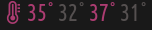

# Script: system-cpu-cores-temp-pure-sh

CPU cores' temperature plugin implemented in pure sh. The only forked process is ``cat``, once per update.




## Dependencies

* Reads temperature from ``/sys/devices/platform/coretemp.0/hwmon/hwmon0/temp?_input``.
* ``/bin/sh``
* ``/bin/cat``


## Configuration

There are two settings in the script, no explaining needed:
```
WARN_TEMP=50
WARN_COLOR='#AC3C71'
```

## Module

```ini
[colors]
icon = #AC3C71

[module/cores_temp]
type = custom/script
exec = ~/.config/polybar/scripts/cpu_cores_temp.sh
interval=5
format-prefix = " "
format-prefix-foreground = ${colors.icon}
...
```
