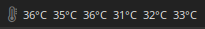

# Script: system-cpu-temppercore

A script that displays the temperature for each core.




## Dependencies

* `lm_sensors`


## Module

```ini
[module/system-cpu-temppercore]
type = custom/script
exec = ~/polybar-scripts/system-cpu-temppercore.sh
interval = 60
```
