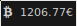

# Script: ticker-btceur

A script that displays the current Bitcoin price.




## Dependencies

* `curl`
* `jq`


## Module

```ini
[module/ticker-btceur]
type = custom/script
exec = ~/polybar-scripts/ticker-btceur.sh
interval = 600
```
