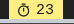

# Script: polybar-timer





This script implements a timer for your polybar.
You can customize the controls and the appearance to your own needs.

Features:
- specific action to execute when timer expires (e.g. notification, shell script, ...)
- interactive:
  * e.g. scroll to increase / decrease
  * click to start predefined timers
  * notification that displays when the timer will expire while interacting
- different icons for different timers

## Dependencies

Inside the script `dunstify` is called to view the end of the timer.
But this is not necessary. (Just beautiful.) Everything will work
fine without dependencies.

## Configuration

Please read the documentation inside the script file.
Then copy the [Module](#module) part and adapt it to your own needs.

The example configuration implements a custom 25min timer with left click, a
custom 5min timer with right click and a normal timer by just scrolling up
from the standby mode.

## Module

```ini
[module/timer]

type = custom/script

exec = /path/to/polybar-timer.sh tail "#" 1
tail = true

click-left = /path/to/polybar-timer.sh new 25 '#' 'notify-send "Session finished"' ; /path/to/polybar-timer.sh update %pid%
click-middle = /path/to/polybar-timer.sh kill ; /path/to/polybar-timer.sh update %pid%
click-right = /path/to/polybar-timer.sh new 5 '#' 'notify-send "Break finished"' ; /path/to/polybar-timer.sh update %pid%
scroll-up = /path/to/polybar-timer.sh inc 60 || /path/to/polybar-timer.sh new 1 '祥' 'notify-send -u critical "Timer expired."' ; /path/to/polybar-timer.sh update %pid%
scroll-down = /path/to/polybar-timer.sh inc -60 ; /path/to/polybar-timer.sh update %pid%
```
