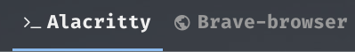

# Script: titles-bspwm

A script to show windows on current desktop in bspwm. Left-click to focus,
right-click to close! The script is ment to be run as a daemon, which
subscribes to bspwm events, parses focused windows and writes them into a
temporary file, unique to each monitor. It then triggers the polybar hook,
which updates the module from this file!



Forked from [this](https://github.com/melangue/bspwm-window-titles) repo.


## Dependencies

Install `xdotool` before running the script.


## Preparation

To use the script, make sure, that all bar
instances use their appropriate `$MONITOR` env variable.  To run the same bar
on multiple monitors, run the bar with something like this in your launch
script (without the `for` loop if using one bar):
```sh
for monitor in $(bspc query -M --names); do
    MONITOR=$monitor polybar mybar &
done
```
For running the titles daemon, copy `titles-bspwm.sh` to `~/.config/polybar/`,
and put this in `launch.sh` before starting the bar:
```sh
...
killall -q titles-bspwm.sh
while pgrep -u $UID -f "titles-bspwm.sh" >/dev/null; do sleep 1; done

$HOME/.config/polybar/titles-bspwm.sh &
...
```
Finally, make sure to enable ipc in the parrent bar (in `config`):
```ini
enable-ipc = true
```


## Configuration

To configure the format of the module, open `titles-bspwm.sh` with a text
editor, and edit these lines:
```sh
display_name="class"
name_cut=15
empty_message="..."
underline_enabled="true"
foreground_focused="-"
background_focused="-"
foreground_unfocused="#999"
background_unfocused="-"
underline_color="#8bbaed"
```
You can also add your own icons to `$icon_map` and populate the `$ignore_list`
with window names, you don't want to see.


## Module

```ini
[module/titles-bspwm]
type = custom/ipc
hook-0 = cat /tmp/bspwm_windows.$MONITOR
initial = 1
```
