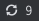
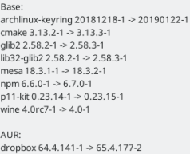
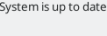

# Script: updates-arch-available

This script is based on [updates-arch-combined](https://github.com/x70b1/polybar-scripts/tree/master/polybar-scripts/updates-arch-combined)
and let you know what updates are available by clicking the icon.



 


## Dependencies

* `pacman-contrib`
* `checkupdates-aur`
* `yad`

## Configuration

You may want to change the coordinates depending on your icon position. By default is x=25,y=25 (top left corner).

## Module

```ini
[module/updates-arch-available]
type = custom/script
exec = ~/.config/polybar/scripts/updates-arch-available.sh
click-left = ~/.config/polybar/scripts/updates-arch-available.sh --updates
interval = 50
```
