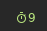

# Script: utility-stopwatch

A simple stopwatch script

 

## Module 

```ini
[module/stopwatch]
type = custom/script

exec = ~/polybar-scripts/polybar-stopwatch.sh display
tail = true

click-left = ~/polybar-scripts/polybar-stopwatch.sh new
click-right = ~/polybar-scripts/polybar-stopwatch.sh cancel ; ~/polybar-scripts/polybar-stopwatch.sh display

format = # <label>
```
