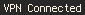
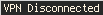

# Script: vpn-mullvad-status

A script that shows if Mullvad is connected, connecting or disconnected.





## Module

```ini
[module/polybar-mullvad-status]
type = custom/script
exec = ~/polybar-scripts/vpn-mullvad-status.sh
interval = 5
```
