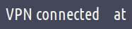

# Script: vpn-mullvad

A script that toggles Mullvad VPN connection with `mullvad` command line client, shows the connection status and optionally the location of the VPN server currently connected to. It is possible to configure the module to cycle through available server locations on scroll too.




## Module

```ini
[module/vpn-mullvad-toggle]
type = custom/script
exec = echo "VPN $(~/polybar-scripts/vpn-mullvad.sh status)"
click-left = ~/polybar-scripts/vpn-mullvad.sh toggle
click-right = ~/polybar-scripts/vpn-mullvad.sh reconnect
interval = 1

;; _-_-_-_-_-_-_-_-_-_-_-_-_-_-_-_-_-_-_-_-_-_

[module/vpn-mullvad-location]
type = custom/script
exec = ~/polybar-scripts/vpn-mullvad.sh location
scroll-up = ~/polybar-scripts/vpn-mullvad.sh previous
scroll-down = ~/polybar-scripts/vpn-mullvad.sh next
interval = 1
```
