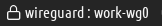
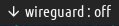

# Script: vpn-networkmanager-wireguard

A script that shows the status of a chosen Wireguard connection using NetworkManager `nmcli`, and toggles the connection when clicked.





## Dependencies

- NetworkManager 1.16.0+

## Configuration

You need to specify the interface name as a the first script arg.

If you don't have configured your Wireguard connection yet, you can use the following command (changing your configuration file):

```sh
nmcli connection import type wireguard file work-wg0.conf
```

## Module

```ini
[module/vpn-networkmanager-wireguard]
type = custom/script
exec =  ~/polybar-scripts/vpn-networkmanager-wireguard/vpn-networkmanager-wireguard.sh work-wg0
click-left =  ~/polybar-scripts/vpn-networkmanager-wireguard/vpn-networkmanager-wireguard.sh work-wg0 --toggle
interval = 5
```