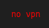

# Script: vpn-nordvpn-status

A small script that shows the status of NordVpn.





## Module

```ini
[module/vpn-nordvpn-status]
type = custom/script
exec = ~/polybar-scripts/vpn-nordvpn-status.sh
interval = 5
```
