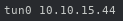

# Script: { vpn-tunX-ip }

{ A script that shows the IP address for each active tun adapter, if one is active, or if not indicates the VPN connection is down. }

 


## Dependencies

{ Requires extremely common standard commands: ip, jq and wc. }


## Configuration

{ You can edit the format lines in the script according to your taste. }


## Module

```ini
[module/vpn-tunX-ip]
type = custom/script
exec = ~/polybar-scripts/vpn-tunX-ip.sh
interval = 5
```
